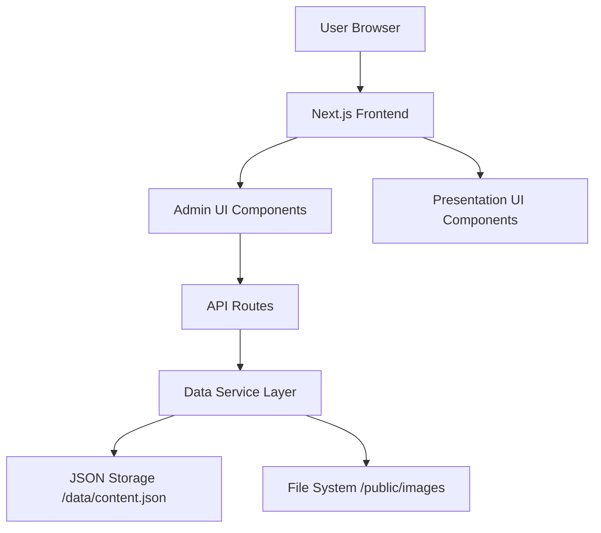

# Admin Panel Design Document

## Overview

The Admin Panel is a simple web-based content editor for the Khao Yai Presentation application. It enables users to edit presentation content (text, images, and structured data) through a straightforward interface without modifying code directly.

### Key Design Principles

1. **Simplicity**: Clean, minimal UI that anyone can use
2. **No Authentication**: Direct access for quick edits
3. **Data Integrity**: Basic validation to prevent errors
4. **Persistence**: Simple JSON file storage
5. **Responsive**: Works on desktop and tablet

### Technology Stack

- **Framework**: Next.js 15 with App Router
- **Language**: TypeScript
- **Styling**: Tailwind CSS 4
- **Icons**: Lucide React
- **Data Storage**: JSON file at `/data/content.json`
- **Image Storage**: `/public/images` directory

## Architecture

### High-Level Architecture



### Directory Structure

```
app/
├── admin/
│   ├── layout.tsx              # Simple admin layout
│   ├── page.tsx                # Admin dashboard
│   ├── trip-info/
│   │   └── page.tsx            # Edit trip information
│   ├── timeline/
│   │   └── page.tsx            # Edit timeline items
│   ├── activities/
│   │   └── page.tsx            # Edit activities
│   ├── restaurants/
│   │   └── page.tsx            # Edit restaurants
│   └── images/
│       └── page.tsx            # Manage images
├── api/
│   ├── data/
│   │   └── route.ts            # Get/Update content.json
│   └── upload/
│       └── route.ts            # Image upload handler
components/
├── admin/
│   ├── AdminNav.tsx            # Simple navigation
│   ├── SectionCard.tsx         # Dashboard cards
│   ├── ImageUpload.tsx         # Image upload component
│   ├── FormField.tsx           # Form input field
│   └── SaveButton.tsx          # Save button with state
lib/
├── data/
│   ├── dataService.ts          # Read/write JSON file
│   └── imageService.ts         # Handle image uploads
└── validation/
    └── schemas.ts              # Basic validation
data/
└── content.json                # All content data
public/
└── images/                     # All uploaded images
```

## Components and Interfaces

### 1. Data Service Layer

#### Data Service Interface

```typescript
// lib/data/dataService.ts
interface DataService {
  // Read all content
  getContent(): Promise<ContentData>;
  
  // Update entire content
  updateContent(data: ContentData): Promise<void>;
  
  // Update specific sections
  updateTripInfo(data: TripInfo): Promise<void>;
  updateTimeline(items: TimelineItem[]): Promise<void>;
  updateActivities(activities: ActivityCard[]): Promise<void>;
  updateRestaurants(restaurants: RestaurantInfo[]): Promise<void>;
  updateImageUrls(imageUrls: ImageUrls): Promise<void>;
}
```

#### Storage Implementation

```typescript
// lib/data/dataService.ts
const DATA_FILE_PATH = 'data/content.json';

export async function readContentData(): Promise<ContentData> {
  // Read from data/content.json
  // If not exists, migrate from constants.ts
}

export async function writeContentData(data: ContentData): Promise<void> {
  // Write to data/content.json
  // Update lastModified timestamp
}
```

**Data Structure:**

```json
{
  "version": "1.0",
  "lastModified": "2024-11-08T10:00:00Z",
  "tripInfo": {
    "title": "Khao Yai Getaway",
    "subtitle": "14 Friends, 2D1N",
    "dates": "เสาร์ 8 - อาทิตย์ 9 พฤศจิกายน 2568",
    "location": "DN Poolvilla Khaoyai",
    "teamSize": 14
  },
  "imageUrls": {
    "hero": "/uploads/hero.jpg",
    "villa": "/uploads/villa.jpg"
  },
  "timeline": [...],
  "activities": [...],
  "restaurants": [...]
}
```

### 2. Image Management

#### Image Service

```typescript
// lib/data/imageService.ts
export async function uploadImage(
  file: File,
  filename: string
): Promise<string> {
  // Save to /public/images/
  // Return path like /images/filename.jpg
}

export function validateImage(file: File): boolean {
  // Check file type and size
  const validTypes = ['image/jpeg', 'image/png', 'image/webp'];
  const maxSize = 5 * 1024 * 1024; // 5MB
  return validTypes.includes(file.type) && file.size <= maxSize;
}
```

**Image Upload Flow:**

1. User selects image file
2. Client validates (type, size)
3. Upload to `/api/upload` endpoint
4. Server saves to `/public/images/`
5. Return path `/images/filename.jpg`
6. Update content.json with new path

**Validation Rules:**
- Allowed formats: JPEG, PNG, WebP
- Max file size: 5MB
- Images saved to `/public/images/`

### 3. Admin UI Components

#### Dashboard Component

```typescript
// app/admin/page.tsx
interface Section {
  id: string;
  title: string;
  description: string;
  icon: LucideIcon;
  href: string;
}

const sections: Section[] = [
  {
    id: 'trip-info',
    title: 'ข้อมูลทริป',
    description: 'แก้ไขชื่อ วันที่ สถานที่',
    icon: Info,
    href: '/admin/trip-info'
  },
  {
    id: 'timeline',
    title: 'ตารางเวลา',
    description: 'จัดการกำหนดการทริป',
    icon: Clock,
    href: '/admin/timeline'
  },
  {
    id: 'activities',
    title: 'กิจกรรม',
    description: 'แก้ไขรายการกิจกรรม',
    icon: Activity,
    href: '/admin/activities'
  },
  {
    id: 'restaurants',
    title: 'ร้านอาหาร',
    description: 'จัดการข้อมูลร้านอาหาร',
    icon: Utensils,
    href: '/admin/restaurants'
  },
  {
    id: 'images',
    title: 'รูปภาพ',
    description: 'อัพโหลดและจัดการรูปภาพ',
    icon: Image,
    href: '/admin/images'
  }
];
```

#### Form Components

```typescript
// components/admin/FormField.tsx
interface FormFieldProps {
  label: string;
  name: string;
  type: 'text' | 'textarea' | 'number' | 'url' | 'tel';
  value: string | number;
  onChange: (value: string | number) => void;
  error?: string;
  required?: boolean;
  placeholder?: string;
}

// components/admin/ImageUpload.tsx
interface ImageUploadProps {
  label: string;
  currentImage?: string;
  onUpload: (url: string) => void;
  category: string;
  aspectRatio?: string;
}
```

### 4. API Routes

#### Data API

```typescript
// app/api/data/route.ts

// GET - Read all content
export async function GET(): Promise<Response> {
  const content = await readContentData();
  return Response.json({ success: true, data: content });
}

// PUT - Update content
export async function PUT(request: Request): Promise<Response> {
  const data = await request.json();
  await writeContentData(data);
  return Response.json({ success: true });
}
```

**Response Format:**

```typescript
interface ApiResponse<T> {
  success: boolean;
  data?: T;
  error?: string;
}
```

#### Image Upload API

```typescript
// app/api/upload/route.ts
export async function POST(request: Request): Promise<Response> {
  const formData = await request.formData();
  const file = formData.get('file') as File;
  
  // Validate
  if (!validateImage(file)) {
    return Response.json({ success: false, error: 'Invalid file' });
  }
  
  // Save to /public/images/
  const path = await uploadImage(file, file.name);
  
  return Response.json({ success: true, path });
}
```

## Data Models

### Core Data Types

```typescript
// lib/types.ts (extended)

// Trip Information
interface TripInfo {
  title: string;
  subtitle: string;
  dates: string;
  location: string;
  teamSize: number;
}

// Timeline Item (existing, with ID added)
interface TimelineItem {
  id: string;                    // Added for CRUD operations
  time: string;
  title: string;
  icon: string;
  description: string;
  isDayMarker?: boolean;
  image?: string;
}

// Activity Card (existing, with ID added)
interface ActivityCard {
  id: string;
  title: string;
  description: string;
  image: string;
  icon: string;
}

// Restaurant Info (existing, with ID added)
interface RestaurantInfo {
  id: string;
  name: string;
  type: string;
  phone: string;
  mapUrl: string;
  image: string;
  notes?: string;
}

// Image URLs mapping
interface ImageUrls {
  [key: string]: string;
}

// Complete content structure
interface ContentData {
  version: string;
  lastModified: string;
  tripInfo: TripInfo;
  imageUrls: ImageUrls;
  timeline: TimelineItem[];
  activities: ActivityCard[];
  restaurants: RestaurantInfo[];
  thongsomboonPackages: any[];
  villaZones: any[];
  houseRules: any[];
  eveningActivities: any[];
  day2Options: any[];
  dressCodeColors: any[];
  checklistItems: any[];
}
```

## Error Handling

### Error Handling Strategy

1. **Client-side validation**: Basic validation before submit
2. **Server-side validation**: Check data before saving
3. **User-friendly messages**: Thai language error messages
4. **Simple error display**: Show error message on page

### Error Messages (Thai)

```typescript
const ERROR_MESSAGES = {
  VALIDATION_REQUIRED: 'กรุณากรอกข้อมูลในช่องนี้',
  VALIDATION_INVALID_URL: 'URL ไม่ถูกต้อง',
  UPLOAD_FILE_TOO_LARGE: 'ไฟล์มีขนาดใหญ่เกินไป (สูงสุด 5MB)',
  UPLOAD_INVALID_TYPE: 'ประเภทไฟล์ไม่ถูกต้อง (JPG, PNG, WebP เท่านั้น)',
  SAVE_FAILED: 'บันทึกไม่สำเร็จ กรุณาลองใหม่',
  LOAD_FAILED: 'โหลดข้อมูลไม่สำเร็จ',
};
```

## Testing Strategy

### Manual Testing Checklist

- [ ] Edit trip information and save
- [ ] Add/edit/delete timeline items
- [ ] Add/edit/delete activities
- [ ] Edit restaurant information
- [ ] Upload images of various sizes and formats
- [ ] Verify changes appear in presentation after refresh
- [ ] Test on desktop and tablet

## Security Considerations

### Basic Security

1. **Input Validation**: Validate all inputs before saving
2. **XSS Prevention**: React's built-in XSS protection
3. **File Upload Security**:
   - Validate file types and sizes
   - Sanitize filenames
   - Limit file sizes to 5MB

**Note**: This is a simple admin panel without authentication. For production use with public access, consider adding basic password protection.

## Performance Considerations

### Simple Optimizations

1. **Image Handling**:
   - Store images in `/public/images`
   - Use Next.js Image component in presentation

2. **Data Loading**:
   - Read JSON file on demand
   - No complex caching needed

3. **Admin Pages**:
   - No caching for admin routes
   - Simple client-side state management

## Migration Strategy

### Phase 1: Setup Infrastructure

1. Install dependencies (NextAuth, Zod, etc.)
2. Create directory structure
3. Set up authentication
4. Create data service layer

### Phase 2: Data Migration

1. Create initial `content.json` from `constants.ts`
2. Update presentation components to use data service
3. Keep `constants.ts` as fallback

### Phase 3: Build Admin UI

1. Create admin layout and navigation
2. Build dashboard
3. Implement each content section editor
4. Add image upload functionality

### Phase 4: Testing and Refinement

1. Test all CRUD operations
2. Test image uploads
3. Verify presentation updates
4. Fix bugs and refine UX

### Backward Compatibility

During migration, the system will:
1. Check if `content.json` exists
2. If yes, use data from JSON
3. If no, fall back to `constants.ts`
4. Provide migration script to generate initial JSON

```typescript
// lib/data/migration.ts
export async function migrateConstantsToJSON(): Promise<void> {
  const constants = await import('@/lib/constants');
  const contentData: ContentData = {
    version: '1.0',
    lastModified: new Date().toISOString(),
    tripInfo: constants.TRIP_INFO,
    imageUrls: constants.IMAGE_URLS,
    timeline: constants.TIMELINE_DATA.map((item, index) => ({
      ...item,
      id: `timeline-${index}`
    })),
    // ... map other data
  };
  await writeJSON('data/content.json', contentData);
}
```

## Future Enhancements

### Potential Features (Out of Scope for MVP)

1. **Password Protection**: Add simple password to access admin panel
2. **Backup System**: Automatic backups of content.json
3. **Image Optimization**: Auto-resize and compress uploaded images
4. **Undo/Redo**: Ability to revert changes
5. **Bulk Image Upload**: Upload multiple images at once

## Deployment Considerations

### Production Checklist

- [ ] Ensure `/data` directory is writable
- [ ] Ensure `/public/images` directory exists and is writable
- [ ] Test file upload functionality
- [ ] Consider adding basic password protection if needed

### Hosting Recommendations

- **Vercel**: Easy deployment with serverless functions
- **Local/Self-hosted**: Full control, simple setup

**Note**: This design requires server-side functionality (API routes), so static export is not suitable.
